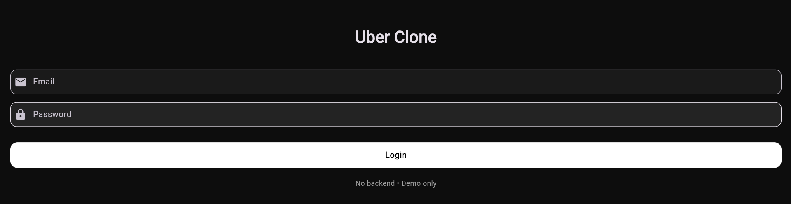
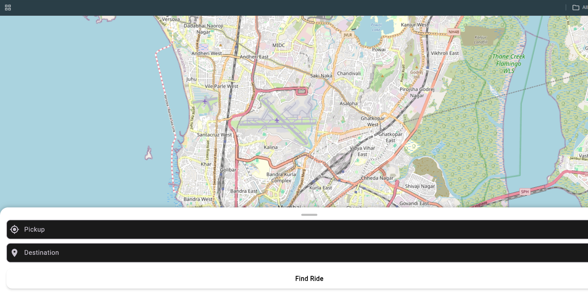
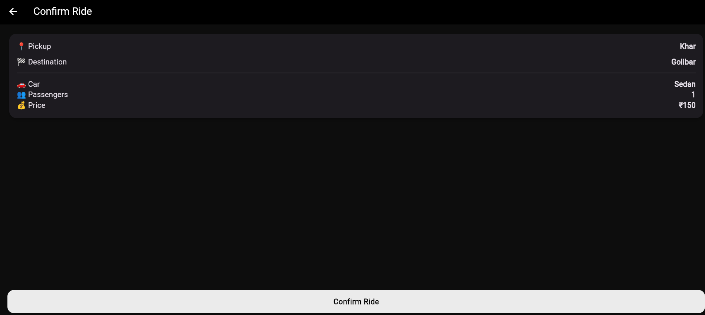

# 🚗 Uber Clone Flutter App

A simple Uber-like app built using Flutter for a college project.  
Includes basic ride booking flow with real map and clean UI.

---

## 🔥 Features

### 🔐 Login Screen  

Simple login UI (no backend)

---

### 🗺️ Home Screen (Map)  

Real map using OpenStreetMap with pickup & destination input

---

### ✅ Confirm Ride  

Shows ride details like pickup, destination, car and price

---

## 🧱 Tech Stack

- Flutter  
- Dart  
- flutter_map (OpenStreetMap)

---

## 🌐 Live Demo

https://sidra-uber-clone-flutter.netlify.app

---

## ⚠️ Note

- UI-based project (no backend)  
- Dummy data used  

---

## 👨‍💻 Author

College Project
